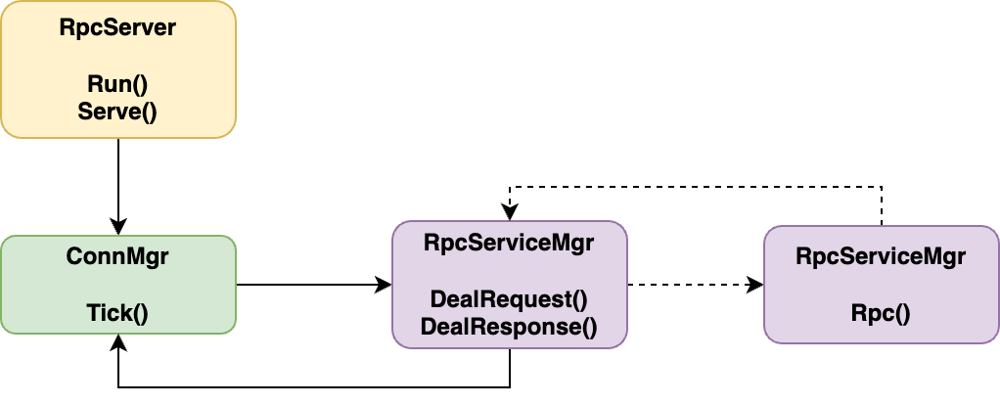
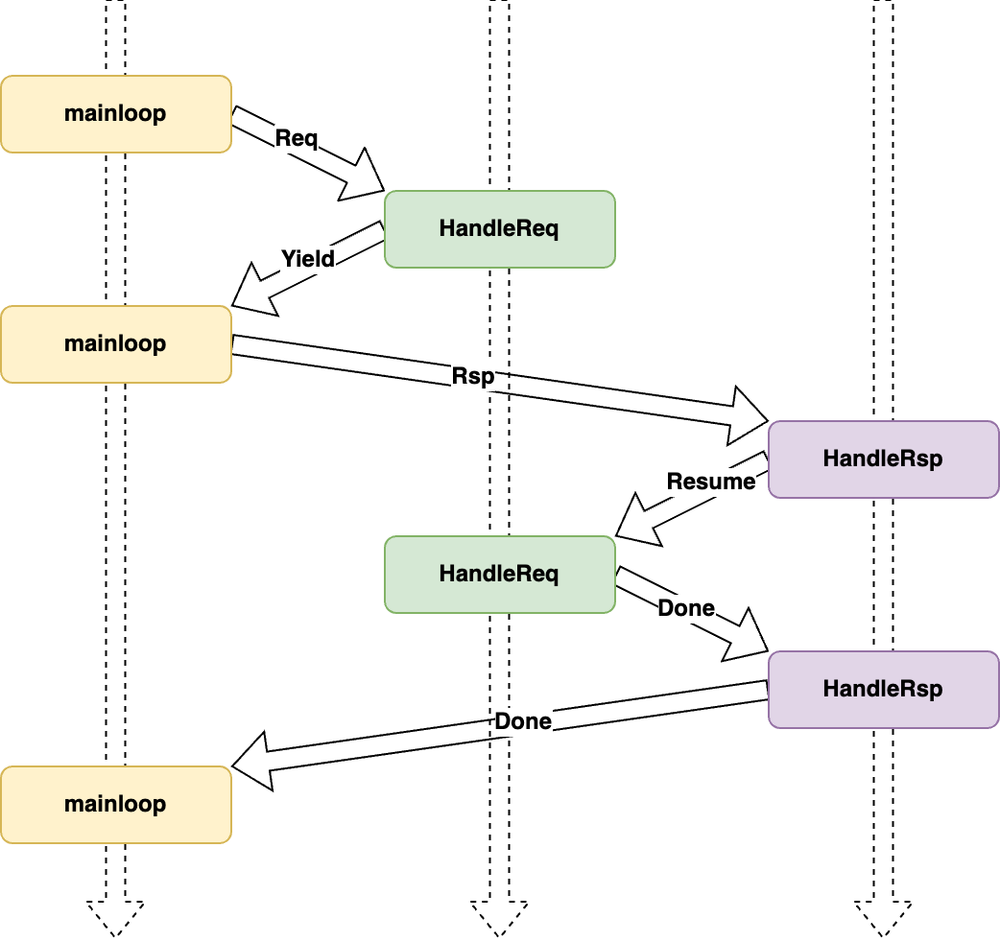
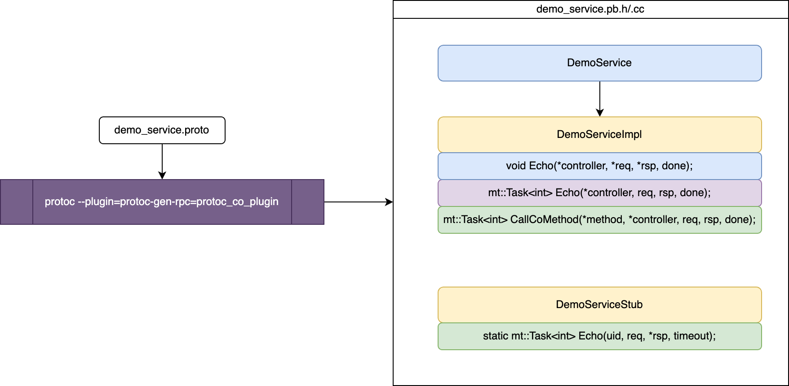

# 一种 C++20 协程下 RPC 服务框架的设计与实现

## 亮点

使用 `C++20` 原生协程来实现一些常用的功能组件，并将其应用至实际的 `RPC` 场景，本项目[^1]给出了一种具体的实现应用方案。

本项目兼顾了业务开发者（库应用端）的 **易用性** 与库性能的 **高效性**。是一种将 `C++20` 协程投入实际生产落地的具体方案，对于细节拓展，也为后续开发者尽可能预留了功能拓展的可能性。

对于实际业务场景来说，注册新的 `Service` 类型族，新的 `Method` 业务功能，都变得非常简单。在本库及相应的插件支持下，业务代码只需要实现相应的 `Method` 内部逻辑即可：

```cpp
mt::Task<int> protocol::DemoServiceImpl::Echo(::google::protobuf::RpcController *controller,
                                              const ::protocol::EchoReq &req, ::protocol::EchoRsp &rsp,
                                              ::google::protobuf::Closure *done) {
    LLOG_TRACE("req: %s", req.ShortDebugString().c_str());
    if (req.msg().size() > 0UL && req.msg()[0UL] != 'A') {
        protocol::EchoReq inner_req;
        protocol::EchoRsp inner_rsp;
        inner_req.set_msg(std::string("ACK: ") + req.msg());
        std::uint64_t uid = 1UL;  // 路由到另一个服务进程（用 uid % channels_num 来路由）
        auto ret = co_await DemoServiceStub::Echo(uid, inner_req, &inner_rsp);
        CO_COND_RET_WLOG(ret != 0, ret, "call DemoServiceStub::Echo failed|ret:%d", ret);
        rsp.set_msg(inner_rsp.msg() + " @2");
        co_return 0;
    }
    rsp.set_msg(req.msg() + " @1");
    co_return 0;
}
```

对于业务中需要向其他服务请求并获得回包数据的场景，会自动挂起当前协程，发送一个 RPC 请求，等到收到相应 RPC 应答回包时，自动恢复当前协程并继续执行。使用协程来编写异步代码，直观性、高效性在此得到充分展现。值得注意的是，`C++20` 下，对于协程调用，这里需要使用 `co_await` 关键字来等待协程执行，相较于以往栈式协程（比如 libco 协程库）而言，可能多了一个语言的关键字，同时要求逻辑本身写在一个协程中（比如本项目会**自动生成代码**，但注意生成的代码体本身是一个协程）。这本身并不能算是一个缺点，而是 `C++20` 语言标准下的一个特点——协程调用就用 `co_await` 来标识（或者说得具体一些，是需要等待协程执行返回值的场景下）。相应的，对于协程内的返回值返回，使用 `co_return` 而非传统函数的 `return`。

对于 `C++` 标准的发展趋势来看，未来 `execution` 进入标准可能会极大弱化这样的协程关键字使用。但处于过渡阶段的当下，熟悉并使用这样的机制还是很必要的。


## 方案设计

### RpcCoroMgr

用于管理挂起的协程上下文，当当前协程需要主动让出时。RpcCoroMgr 将保存当前协程的上下文，并将执行流主动让给调用者。当后续收到协程关注的网络回包数据时，通过回包内的序列号确定这个关注的协程 ID，继而恢复这个协程的执行。首先，RpcCoroMgr 定义的类型如下：

```cpp
class RpcCoroMgr : public mt::Singleton<RpcCoroMgr> {
public:
    using coro_uid_type = std::uint64_t;
    struct context {
        int session_id = 0;
        std::coroutine_handle<> handle = nullptr;
        ::google::protobuf::Message *rsp = nullptr;
    };
...
```

这里的 `session_id`` 是用于通道通信时使用的标识，这个和实现机制有关，阅读源码可以明晰其具体作用。简单来说，这里挂起的上下文结构体的内容，需要保证恢复执行时，依然能确保之前执行逻辑所需要的相关环境数据即可。

同样的，`RpcCoroMgr` 的成员变量定义也很简洁：

```cpp
...
private:
    std::unordered_map<coro_uid_type, context> suspended_contexts_;
    // coro_uid generator, which could generate unique id without `0`.
    static coro_uid_type coro_uid_generator_;
    bool use_coro_ = false;
};
```

这里的 `suspended_contexts_` 成员保存的就是协程唯一 ID 与被挂起的协程上下文之间的映射关系。在明晰了上述定义的类型与成员变量后，明确 `RpcCoroMgr` 提供的两个功能接口：

```cpp
...
public:
    bool Suspend(coro_uid_type coro_uid, context ctx) { return suspended_contexts_.insert({coro_uid, ctx}).second; }

    context Pop(coro_uid_type coro_uid) {
        if (auto iter = suspended_contexts_.find(coro_uid); iter != suspended_contexts_.end()) {
            auto ctx = iter->second;
            suspended_contexts_.erase(iter);
            return ctx;
        }
        LLOG_ERROR("coro_uid not found|coro_uid:%lu", coro_uid);
        return context{.handle = {}, .rsp = nullptr};
    }
...
```

由此可见，`RpcCoroMgr` 提供了最基础的挂起保存上下文和弹出指定协程 ID 的上下文两个接口，后续可以将这两个功能接口与必要的挂起/恢复点逻辑结合起来，从而实现执行流的切换（有些类似于 `libco` 的 `coctx_swap`，但于 `libco` 而言，是从汇编层面替换堆栈寄存器数据）。

### SaveContextAwaiter

在确定了上述的 `RpcCoroMgr` 功能及其需要的参数以后，就需要考虑如何获取相关的参数。很明显，这里需要将控制流句柄（`std::coroutine_handle` 对象。句柄这个词已经被广泛使用了，这里也）获取并传递。为了获取当前协程的句柄，可以构造一个 `awaiter` 对象，当对这个对象使用单目运算符 `co_await` 时，编译器生成代码逻辑会将协程句柄传递给这个 `awaiter` 类的 `await_suspend` 成员函数函数。在解决这个句柄参数的获取问题后，就可以将其他参数通过这个 `awaiter` 对象的构造函数来传递。所以为了实现保存上下文功能而定义的 `awaiter` 类，其代码如下：

```cpp
struct SaveContextAwaiter {
public:
    SaveContextAwaiter(RpcCoroMgr::coro_uid_type coro_uid, RpcCoroMgr::context context)
        : coro_uid_(coro_uid), context_(context) { }

    bool await_ready() const noexcept { return false; }

    decltype(auto) await_suspend(std::coroutine_handle<> handle) {
        LLOG_INFO("suspend coro|coro_uid:%lu|%p|rsp:%p", coro_uid_, handle.address(), context_.rsp);
        context_.handle = handle;
        RpcCoroMgr::GetInst().Suspend(coro_uid_, context_);
        return true;
    }

    void await_resume() { }

private:
    RpcCoroMgr::coro_uid_type coro_uid_ = 0UL;
    RpcCoroMgr::context context_;
};
```

对于 `await_suspend` 的返回值类型，如果是 `bool` 类型，当返回 `true` 时，当前协程执行挂起并将执行流返还给调用者/恢复者；当返回 `false` 时，当前协程会继续执行，继而调用执行 `await_resume` 函数并返回其执行结果。关于这部分内容，如果不了解、不熟悉，建议优先阅读 [_C++ Coroutines: Understanding operator co_await_](https://lewissbaker.github.io/2017/11/17/understanding-operator-co-await)。

### RpcServiceMgr

在定义并明晰了上述类型的功能概念后，对于具体注册的 `RPC` 服务，用一个统一的包装类 `RpcServiceMgr` 来实现 `RPC` 通用逻辑执行流程的管理。

首先，明晰一下 `RpcServiceMgr` 在进程中的作用与主要接口：



<p align="center">
图 1 逻辑执行流程
<p>

在 `RpcServer` 的服务接口内，主循环调用 `ConnMgr` 单例的 `Tick` 来进行网络收发包。当收取到一个网络包时，首先解析数据包类型是请求包还是回复包。对于前者，往往是客户端（内部服务间 RPC 调用时，调用者本身在这个调用关系中也可以视为客户端）发过来的请求，此时调用 `RpcServiceMgr` 的 `DealRequest` 协程来处理；对于后者，往往是进程本身作为客户端收到请求回包的场景，此时调用 `RpcServiceMgr` 的 `DealResponse` 协程来处理。

当在执行 `DealRequest` 的过程中，如果处理执行的业务逻辑内依赖了另一个服务进程的回包，此时就调用 `RpcServiceMgr` 的 `Rpc` 接口来发起请求。由此可见，所有的异步请求都可以收敛到这个 `Rpc` 请求接口内，进而发起请求时挂起当前协程的逻辑写在这里就可以。

考虑一种实际的业务需求，当发起的 `RPC` 本身不需要等待回包即可完成逻辑执行时（比如逻辑内只需要发送一个无关紧要的通知包），此时就无需挂起当前协程，继续执行逻辑即可。这一部分的优化可以体现在实现代码中：

```cpp
mt::Task<int> RpcServiceMgr::Rpc(std::uint32_t cmd, std::uint64_t uid, const ::google::protobuf::Message &req,
                                 ::google::protobuf::Message *rsp, std::uint32_t timeout) {
    LLOG_TRACE("call rpc|uid:%lu|req: %s", uid, req.ShortDebugString().c_str());
    assert(!channels_.empty());

    std::uint64_t seq_id = RpcCoroMgr::GetInst().NewCoroUid();
    PkgHead pkg_head{.src = 0UL, .dst = 0UL, .uid = uid, .seq = seq_id, .cmd = cmd};
    auto *channel = channels_[uid % channels_.size()];
    channel->Send(pkg_head, req);

    if (rsp) {
        COND_EXP(seq_id == 0UL, channel->BlockingWaitResponse(rsp); co_return 0);  // 针对 client 先阻塞
        RpcCoroMgr::context context{.session_id = session_id_, .rsp = rsp};
        co_await mt::dump_call_stack();
        co_await SaveContextAwaiter{seq_id, context};
        LLOG_INFO("RESUME TO CURRENT COROUTINE");
        co_await mt::dump_call_stack();
    }
    co_return 0;
}
```

对于 `DealRequest` 而言，其逻辑主要就是根据请求包确定具体的 `Service` 及 `Method` 类型，进而通过调用相关的业务侧实现的接口来完成相应的业务逻辑。值得注意的是，为了保证相关流程被挂起后能恢复执行，这里就需要让相应的业务侧实现接口本身是一个协程。这样才能保证调用内层协程被挂起的时候，外层的逻辑也是被挂起等待后续恢复执行的。

而对于 `DealResponse` 来说，其逻辑就相对简洁明了很多。核心的逻辑就是确定具体的被挂起的协程，进而将其恢复执行。回到执行流上，这段被恢复的协程执行完毕后，执行流会回到 `DealResponse` 上，此时还可以补充额外的定制化逻辑。

综上，对于网络包的处理流程，把 `DealRequset` 和 `DealResponse` 抽象为 `HandleReq` 和 `HandleRsp` 的通用操作，那么对于一个处理请求过程中存在等待网络请求回包的场景，其执行流程时序图大致如下：



<p align="center">
图 2 处理请求过程中存在等待网络请求回包场景的执行流程时序图
<p>

### protoc_co_plugin

明确了上述所有组件功能及实现原理后，将视角聚焦到业务开发者。对于业务开发者而言，其关注的更多的只是具体业务的逻辑。对于 `RPC` 框架而言，往往也就是具体的一个个的 `Method` 逻辑实现。在上述框架下，为了保证逻辑内可能的向其他服务请求的场景，也就是说具体 `Method` 内，依然可能需要调用一个能够支持协程请求的 `Method`。对于服务端而言，其所有的这样的协程调用，均可以收敛到前文所述的 `RpcServiceMgr::Rpc` 接口，那么又该如何用一个相对优雅的方式来使得业务调用相对简洁而又保证形式、逻辑统一呢？

针对一个具体的 `protobuf` 定义的 `Service` 及 `Method` 示例：

```protobuf
service DemoService {
    rpc Echo(EchoReq) returns (EchoRsp) { option(RPC_CMD) = DEMO_SERVICE_ECHO; }
}
```

这里指定了必要的 `rpc` 所需的字段，同时还添加了一个 `option(RPC_CMD)`，这个是和业务相关的 `命令字`，用于区分具体的 `Method`。可以预知，当业务功能繁杂时，类似的 `rpc` 定义的 `Method` 会越来越多，但他们的形式都是非常类似的。为了支持 C++20 下形式类似于 `co_await Rpc::Method` 的协程调用，其内部逻辑会是这个样子：

```cpp
mt::Task<int> DemoServiceStub::Echo(std::uint64_t uid,
                                    const EchoReq& request, EchoRsp* response,
                                    std::uint32_t timeout) {
  if (timeout == 0U)
    timeout = 5000U;
  co_return co_await RpcServiceMgr::GetInst().Rpc(0x1000001U, uid, request, response, timeout);
}
```

既然代码形式如此简单、结构重复性如此之强，那么这样的代码自然首选使用插件来自动生成。`protoc`[^2] 在将 `.proto` 文件生成目标的 `.pb.h`、`.pb.cc` 文件时，可以支持插件自定义插入生成业务代码，所以可以实现这样一种支持 `C++20` 协程的接口代码：



<p align="center">
图 3 protoc_co_plugin 插件启用参数及其生成的代码结构
<p>

在构建时指定相应插件参数，`protoc` 生成的最终代码就会包含自定义的插件实现的生成代码。这里可以看到，除了一些 `protobuf` 必要生成的类及接口（图中淡蓝色）外，还有两个自定义生成的类（图中浅黄色）：`DemoServiceImpl` 和 `DemoServiceStub`。前者用于定义服务端业务接口逻辑，后者用于模拟客户端发起 `RPC` 协程调用。这里为了确保协程层层调用才能在挂起后沿调用栈逐层恢复执行，这里改造了一个必要的接口：`CallCoMethod`。其功能对应于 `protobuf` 生成的 `CallMethod`，只是在这里为了支持 `C++20` 的协程调用，将其单独定义了相似的一套。对于 `CallCoMethod` 及 `XXXServiceStub::Echo` 而言，其代码可以通过 `proto` 原型文件确定，故可以在此生成阶段直接生成（图中也用浅绿色进行了标识）。那么，此时对于业务而言，仅需实现具体的功能接口（图中淡紫色）逻辑即可。

为了更好地展示框架的易用效果，这里给出一种功能逻辑下的业务代码（与 [亮点](#亮点) 章节的示例代码相同）：

```cpp
mt::Task<int> protocol::DemoServiceImpl::Echo(::google::protobuf::RpcController *controller,
                                              const ::protocol::EchoReq &req, ::protocol::EchoRsp &rsp,
                                              ::google::protobuf::Closure *done) {
    LLOG_TRACE("req: %s", req.ShortDebugString().c_str());
    if (req.msg().size() > 0UL && req.msg()[0UL] != 'A') {
        protocol::EchoReq inner_req;
        protocol::EchoRsp inner_rsp;
        inner_req.set_msg(std::string("ACK: ") + req.msg());
        std::uint64_t uid = 1UL;  // 路由到另一个服务进程（用 uid % channels_num 来路由）
        auto ret = co_await DemoServiceStub::Echo(uid, inner_req, &inner_rsp);
        CO_COND_RET_WLOG(ret != 0, ret, "call DemoServiceStub::Echo failed|ret:%d", ret);
        rsp.set_msg(inner_rsp.msg() + " @2");
        co_return 0;
    }
    rsp.set_msg(req.msg() + " @1");
    co_return 0;
}
```

> 这段代码的功能逻辑很简单。如果请求包的字符串以 `A` 开头，就直接在后面补充添加 ` @1` 并将其回包；否则在其请求串前添加 `ACK: ` 前缀，并将其转发到另一个服务进程（具体路由转发规则可自行定义），协程等待回包，在获得回包后，后接 ` @2` 并将其回包。

### 其他

本文详述了一种 `C++20` 协程与 `RPC` 框架的结合落地方案，其使用形式与以往存在一些差异，但就**易用性**而言，是几乎没有任何减损的。对于 `C++20` 协程的**高效性**，@regangcli 给出了和传统 `libco` 实现方案的对比并有相应的具体量化数据差异对比[^3]。`C++20` 创建协程的纳秒级效率令人惊叹，对于技术的探索实践也是值得我们不断尝试的事情。

## 参考

- [Lewis Baker 的 Asymmetric Transfer 系列博客](https://lewissbaker.github.io/)
- [github/netcan/asyncio](https://github.com/netcan/asyncio)
- [github/lewissbaker/cppcoro](https://github.com/lewissbaker/cppcoro)

### 推荐

- [基于C++20无栈协程与protobuf的轻量级、高性能RPC框架](https://km.woa.com/articles/show/583648)

[^1]: 本项目源码均已开源，仓库地址：[git.woa.com/modnarshen/MT](https://git.woa.com/modnarshen/MT)、[github](https://github.com/Modnars/MT)。
[^2]: 本项目使用的 `protoc` 版本为 `libprotoc 3.20.3`。对于 `option` 等的支持，不同版本间可能存在差异，使用时需要具体关注。
[^3]: 参考项目 [github.com/lgc1112/cpp20coroutine-protobuf-rpc](https://github.com/lgc1112/cpp20coroutine-protobuf-rpc) 及 [项目文档](https://github.com/lgc1112/cpp20coroutine-protobuf-rpc#readme)、[博客文章](https://km.woa.com/articles/show/583648)
